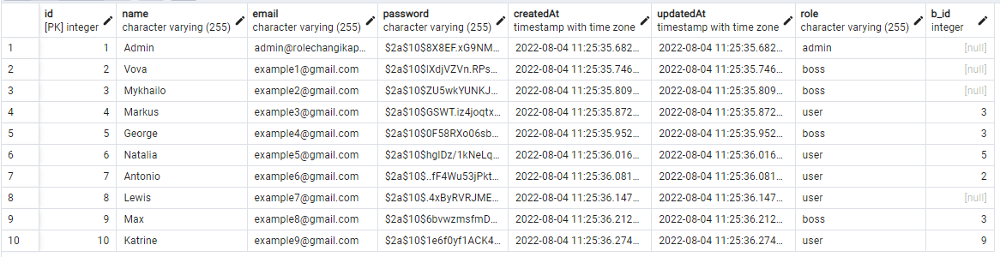
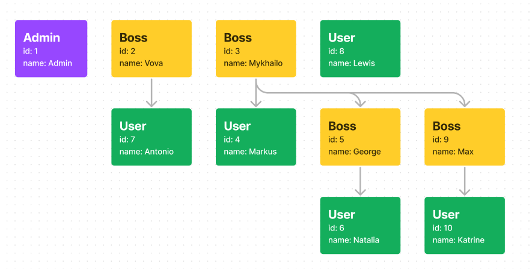

# This Role Changik App

### Technical Documentation

Create a tiny server app based on Node.js.

The app should implement simple organization user structure management operations.
The following user roles should be supported:
a. Administrator (top-most user)
b. Boss (any user with at least 1 subordinate)
c. Regular user (user without subordinates)

Each user except the Administrator must have a boss (strictly one).
The following REST API endpoints should be exposed:
- [x] Register user
- [x] Authenticate as a user
- [x] Return list of users, taking into account the following:
  - [x] administrator should see everyone
  - [x] boss should see herself and all subordinates (recursively)
  - [x] regular user can see only herself
- [x] Change user's boss (only boss can do that and only for her subordinates)

### Technologies
I used several technologies and npm libraries

- node v16.15.1
- npm v8.11.0
- express
- express-validator
- jwt
- postgresql
- sequalize
- bcryptjs
- cors

Also, few development dependencies

- nodemon
- prettier
- sequelize-cli

> NOTE: List of all dependencies, you can find at **package.json** file

### Description | Architecture
I want to describe my implementation of this task.

#### Api routes
This is small descripion of all api routes

> I created **Postman** collection with endpoints, and requires data, and examples of API calls, you can view, here:

[](https://www.postman.com/speeding-star-121415/workspace/test-workspace/collection/12964765-cf9ec59f-14ff-41e9-9414-8cd7ebd7fc85?action=share&creator=12964765)


##### Auth routes
```
POST - /api/auth/singin
POST - /api/auth/singup
```

##### View users route
> I created logic, that depending on your JWT token,
> server will, look at your role stored at DB,
>
> if you are ADMIN, you will see all users,
> if you are BOSS, you will see: yourself and all your subordinates
> if you are USER, you will see: only yourself
>
> So, you pass only JWT token, and server will do, all dirty work)
```
GET - /api/view/users
```

##### Boss routes
> 
> 
```
GET - /api/boss/avaliable
POST - /api/boss/change
```

#### Schema of seeded data
Also, I represent a small illustration for seeded data below, and you can interact with this data, when app is fully installed

This is seeded data at DB: 

This is illustration for seeded data 

### How to run

**Firstly, clone repo**
```sh
git clone https://github.com/nkshn/role-changik.git
```

**Go to project folder**
```sh
cd role-changik
```

**Then install dependencies**
```sh
npm ci
```
> Why **npm ci** but not **npm install**?
> Because **npm ci**, will install dependencies from **package-lock.json** file
> And i think, this will garanty that, it will run the same on your computer as it runs on my
> So thats why, i prefer **npm ci** instead of **npm install**

**Also at project folder, create .env file, with your own credentials**
> NOTE: You can find all required credentials at file: **.env.example**

Example of **.env** file

```
NODE_ENV=development

PORT=5000

DOMAIN=localhost
DEFAULT_LANGUAGE=en
TZ=EET

POSTGRES_HOST=localhost
POSTGRES_PORT=5432
POSTGRES_USER=db_name
POSTGRES_PASSWORD=postgres
POSTGRES_DB=password

JWT_ACCESS_SECRET=jwt-secret-token
JWT_EXPIRATION_TIME=1d

SEED_USER_TEST_PASSWORD=password
```

**Then, boostrap Database, using docker**
```sh
docker compose up -d
```

**To create DB, run migrations and seeds, run this command:**
```sh
npm run db:fresh
```

**Finally, run the app, by using this command:**
```sh
npm run app:dev
```

### Last few word !)
Thanks for the interesting task, that was a big pleasure, to work on this task, and have i nice day)
> P.S. In the future I would like to refactor it using Nest.js

### License

ISC